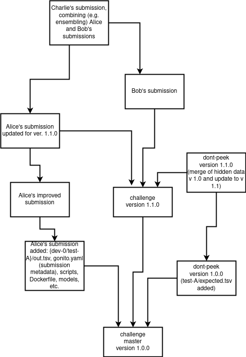

Gonito platform
===============

[Gonito](https://gonito.net) (pronounced _ɡɔ̃ˈɲitɔ_) is a Kaggle-like
platform for machine learning competitions (disclaimer: Gonito is
neither affiliated with nor endorsed by [Kaggle](https://www.kaggle.com)).

What's so special about Gonito:

  * free & open-source (GPL), you can use it your own, in your
    company, at your university, etc.
  * git-based (challenges and solutions are submitted only with git).

See the home page (and an instance of Gonito) at https://gonito.net .

Installation
------------

## For development

[Gonito](https://gonito.net) is written in [Haskell](https://www.haskell.org) and uses
[Yesod Web Framework](http://www.yesodweb.com/), but all you need is
just [the Stack tool](https://github.com/commercialhaskell/stack). See https://github.com/commercialhaskell/stack
for instruction how to install Stack on your computer.

By default, Gonito uses [Postgresql](http://www.postgresql.org/), so it needs to be installed and running at your computer.

After installing Stack:

    createdb -E utf8 gonito   # Postgres needs to be configured
    git clone --recurse-submodules git://gonito.net/gonito
    cd gonito
    stack setup
    # before starting the build you might need some non-Haskell dependencies, e.g. in Ubuntu:
    # sudo apt-get install libbz2-dev liblzma-dev libpcre3-dev libcairo-dev libfcgi-dev
    stack build
    stack exec yesod devel

The last command will start the Web server with Gonito (go to
http://127.0.0.1:3000 in your browser).

## With docker-compose

The easiest way to run Gonito is with docker-compose.

    git clone --recurse-submodules https://gitlab.com/filipg/gonito
    cd gonito
    cp sample.env .env
    # now you need to edit .env manually,
    # in particular, you need to set up the administrator's
    # password and paths to volumes for the volumes,
    # cloned data ("arena"), certificates and SSH data;
    # also you need to set up your certificate
    # here is an easy way to do it just for local
    # testing
    mkdir certs
    cd certs
    # generating certificates for HTTPS, remember to
    # set the `NGINX_CERTIFICATE_DIR` variable in `.env`
    # so that it would point to `certs` here
    openssl req -x509 -newkey rsa:4096 -keyout privkey.pem -out fullchain.pem -days 365 -nodes
    cd ..
    docker-compose up

Gonito will be available at <https://127.0.0.1/>. Of course, your
browser will complain about "Potential Security Risk" as these are
local certificates.

Gonito as backend
-----------------

On the one hand, Gonito is a monolithic Web application without front-
and back-end separated. On the other, some features are provided as
end-points, so that Gonito could be used with whatever front-end. The
documentation in the Swagger format is provided at `/static/swagger-ui/index.html`.
(see <https://gonito.net/static/swagger-ui/index.html> for this at the main instance).

Keycloak is assumed as the identity provider here for those end-points that
require authorization.

Integration with Keycloak
-------------------------

Gonito can be easily integrated with Keycloak for the back-end
end-points (but not yet for signing in Gonito as the monolithic Web
application, this feature is on the way).

1. Let's assume that you have a Keycloak instance. A simple way to run
   for development and testing is: `docker run -e KEYCLOAK_USER=admin -e KEYCLOAK_PASSWORD=admin -p 8080:8080 jboss/keycloak`.

2. You need to set up the JWK key from your Keycloak instance.
   Go to `https://<KEYCLOAK-HOST>/auth/realms/<KEYCLOAK-REALM>/protocol/openid-connect/certs`
   (e.g. for the Docker run as given in (1): <http://127.0.0.1:8080/auth/realms/master/protocol/openid-connect/certs>)
   and copy the contents of the key from the JSON the (key/0 element
   not the whole JSON!).

3. Create `gonito` client in Keycloak (_Clients_ / _Create_).

4. Set _Valid Redirect URIs_ for the `gonito` client in Keycloak (e.g. simply add `*` there).

5. Set _Web Origin_ for the `gonito` client in Keycloak (e.g. simply add `*` there).

6. Add some test user, set up some first/last name for them.

7. Set `JSON_WEB_KEY` variable to the content of the JWK key (or `GONITO_JSON_WEB_KEY` when using docker-compose)
   and run Gonito.

If you create a new user, you need to run `/api/add-info` GET
end-point. No parameters are needed it just read the user's data from
the token and adds a record to the Gonito database.

You can simulate a front-end by going to `/static/test-gonito-as-backend.html`.

Gonito & git
------------

Gonito uses git in an inherent manner:

* challenges (data sets) are provided as git repositories,
* submissions are uploaded via git repositories, they are referred to with
  git commit hashes.

Advantages:

* great flexibility as far as where you want to keep your challenges
  and submissions (could be external, well-known services such as
  GitHub or GitLab, your local git server, let's say gitolite or Gogs, or
  just a disk accessible in a Gonito instance),
* even if Gonito ceases to exist, the challenges and submissions are still available
  in a standard manner, provided that git repositories (be it external or local) are
  accessible,
* data sets can be easily downloaded using the command line
  (e.g. `git clone git://gonito.net/paranormal-or-skeptic`), without
  even clicking anything in the Web browser,
* facilitates experiment repeatability and reproducibility (at worst
  the system output is easily available via git)
* tools that were used to generate the output could be linked as git subrepositories
* some challenge/submission metadata are tracked in a Gonito-independent way
  (within git commits),
* copying data can be avoided with git mechanisms (e.g. when the challenge is already
  cloned, downloading specific submissions should be much quicker),
* large data sets and models could be stored if needed using mechanisms such as git-annex (see below).

### Commit structure

The following flow of git commits is recommended (though not required):

* the challenge without hidden data for main test sets (i.e. files such as `test-A/expected.tsv`)
  should be pushed to the `master` branch
* the hidden files (`test-A/expected.tsv`) should be added in a
  subsequent commit and pushed either to the `dont-peek` branch or a
  `master` branch of a separate repository (if access to the hidden
  data must be more strict),
* the submissions should be committed with the `master` branch as the
  parent (or at least ancestor) commit and pushed to the same
  repository as the challenge data (in some user-specific branch) or any other
  repository (could be user-owned repositories)
* any subsequent submissions could be derived in a natural way from other git commits
  (e.g. when a submission is improved, or even two approaches are merged)
* new versions of the challenge can be committed (a challenge can be updated at Gonito)
  to the `master` (and `dont-peek`) branches

See also the following picture:

### git-annex

In some cases, you don't want to store challenge/submissions files simply in git:

* very large data files, textual files (e.g. `train/in.tsv` even if
  compressed as `train/in.tsv.xz`)
* binary training/testing data (PDF files, images, movies, recordings)
* data sensitive due to privacy/security concerns (a scenario where it's OK to store
  metadata and some files in a widely accessible repository, but some files require
  limited access)
* large ML models (note that Gonito does not require models for evaluation, but still
  it might be a good practice to commit them along with output files and scripts)

Such cases can be handled in a natural manner using git-annex, a git
extension for handling files and their metadata without commiting
their content to the repository. The contents can be stored at a wide
range of [special
remotes](https://git-annex.branchable.com/special_remotes/), e.g. S3
buckets, WebDAV, rsync servers.

It's up to you which files are stored in git in a regular manner and
which are added with `git annex add`, but note that if a
challenge/submission file must be stored via git-annex and are required
for evaluation (e.g. `expected.tsv` files for the challenge or
`out.tsv` files for submissions), the git-annex special remote must be
given when a challenge is created or a submission is done and the
Gonito server must have access to such a special remote.

Authors
-------

* Filip Graliński

References
----------

    @inproceedings{gralinski:2016:gonito,
      title="{Gonito.net - Open Platform for Research Competition, Cooperation and Reproducibility}",
      author={Grali{\'n}ski, Filip and Jaworski, Rafa{\l} and Borchmann, {\L}ukasz and Wierzcho{\'n}, Piotr},
      booktitle="{Branco, Ant{\'o}nio and Nicoletta Calzolari and Khalid Choukri (eds.), Proceedings of the 4REAL Workshop: Workshop on Research Results Reproducibility and Resources Citation in Science and Technology of Language}",
      pages={13--20},
      year=2016,
      url="http://4real.di.fc.ul.pt/wp-content/uploads/2016/04/4REALWorkshopProceedings.pdf"
    }
